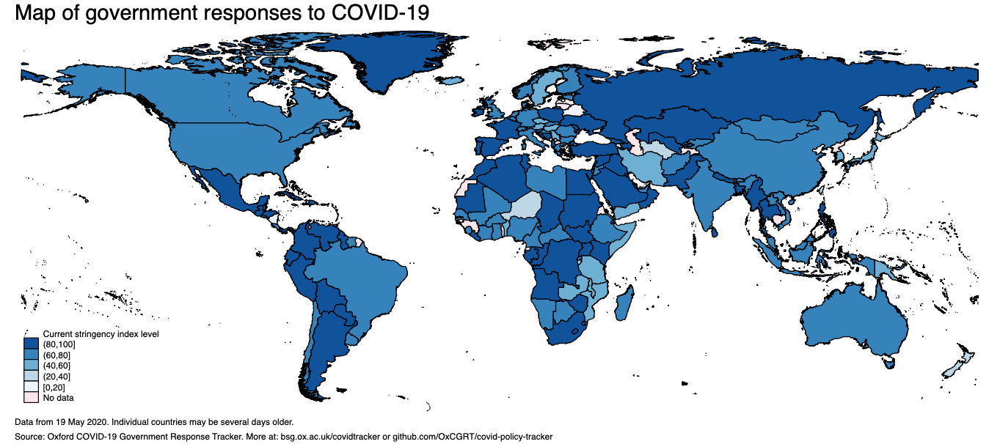
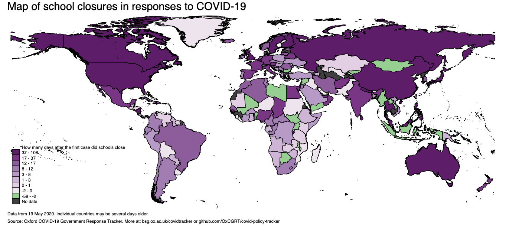

# Oxford Covid-19 Government Response Tracker (OxCGRT)

The Oxford Covid-19 Government Response Tracker (OxCGRT) collects systematic information on which governments have taken which measures, and when. This can help decision-makers and citizens understand the stringency of governmental responses in a consistent way, aiding efforts to fight the pandemic. The OxCGRT systematically collects information on several different common policy responses governments have taken, scores the stringency of such measures, and aggregates these scores into a common Stringency Index.

This is a project from the [Blavatnik School of Government](www.bsg.ox.ac.uk). More information on the OxCGRT is available on the school's website: https://www.bsg.ox.ac.uk/covidtracker. This README contains information about using the database.

---

__Cite as:__ Thomas Hale, Sam Webster, Anna Petherick, Toby Phillips, and Beatriz Kira. (2020). _Oxford COVID-19 Government Response Tracker_. Blavatnik School of Government.

---

## The database

OxCGRT collects publicly available information on 17 indicators of government response. This information is collected by a team of over 100 volunteers from the Oxford community and is updated continuously.

We also include statistics on the number of reported Covid-19 cases and deaths in each country. These are taken from the European Centre for Disease Prevention and Control ([ECDC](https://www.ecdc.europa.eu/en)) for most countries, and from the [JHU CSSE data repository](https://github.com/CSSEGISandData/COVID-19) for the Chinese special administrative regions of Hong Kong and Macau.

### Individual policy measures

Full descriptions of the policy indicators and their meaning can be found in our [codebook](documentation/codebook.md).

Eight of the policy indicators (C1-C8) record information on [_containment and closure_ policies](documentation/codebook.md#containment-and-closure-policies), such as school closures and restrictions in movement. Four of the indicators (E1-E4) record [_economic_ policies](documentation/codebook.md#economic-policies) such as income support to citizens or provision of foreign aid. And five indicators (H1-H5) record [_health system_ policies](documentation/codebook.md#health-system-policies) such as the Covid-19 testing regime or emergency investments into healthcare.

Finally, we have a [miscellaneous indicator (M1)](documentation/codebook.md#miscellaneous-policies) for notes that do not fit elsewhere.

### Legacy database structure (from before 25 April 2020)

Prior to 25 April 2020 the OxCGRT had a structure of 13 indicators (labelled S1-S13). Data up until this point is archived and still available in the [/legacy_data_20200425](legacy_data_20200425/) folder.

### Our working paper has more information

We have published a [working paper](https://www.bsg.ox.ac.uk/research/publications/variation-government-responses-covid-19) with our methodology, data collection protocols, and description of the individual indicators. (Although the most up-to-date description of indicators is always in the [codebook](documentation/codebook.md).)

### Stringency index

The Stringency Index is a nine-point aggregation of the eight _containment and closure_ indicators as well as H1 (public information campaigns). It reports a number between 0 to 100 that reflects the overall stringency of the governments response. This is a measure of how many of the these nine indicators (mostly around social isolation) a government has acted upon, and to what degree.

It does not take into account any _economic_ indicators or _health system_ policies beyond H1.

We have published a [short note with a detailed explanation](https://www.bsg.ox.ac.uk/sites/default/files/Calculation%20and%20presentation%20of%20the%20Stringency%20Index.pdf) of how the stringency index is calculated, and also how it is reported for days with incomplete data are handled. This also describes how we are reporting a _legacy_ index while we finalise the transition from the [old](#legacy-database-structure-from-before-25-April-2020) database structure.

## Using OxCGRT data

The OxCGRT is updated continuously in real time. There are numerous ways you can access the raw data.

### Getting data from this GitHub repository
 <-- status of connection to OxCGRT database

The [/data](data/) folder in this repo contains recent exports from the OxCGRT database. You are welcome to build applications that draw directly from this repository.
- The CSV file [/data/OxCGRT_latest.csv](data/OxCGRT_latest.csv) is a full export from the database presented in "country-day" format, with each a list of all indicators for each country as a single row each day. This CSV is updated every hour from the main database, and the badge above shows whether this data link is functioning correctly.
- The CSV file [/data/OxCGRT_latest_withnotes.csv](data/OxCGRT_latest_withnotes.csv) is a full export from the database in "country-day" format _with_ a column of notes from our data collectors for each indicator. This is also updated every hour from the main database. Please note that some of the comments contain commas and other characters interpreted as a delimiter, and so may cause problems when parsing this CSV file.
- The CSV file [/data/OxCGRT_latest_allchanges.csv](data/OxCGRT_latest_allchanges.csv) is a full export from the database with a list of every _change_ to the database. Every time a policy value changes, or every time a note is added to an indicator, it is represented with it's own new row.
- The [/data/timeseries](data/timeseries/) folder contains individual timeseries for each indicator (except S8-S11, for which our data coverage is not consistent) in CSV format, as well as a combined Excel file with a tab for each indicator. This is updated periodically – usually daily – and the date will be listed in the commit description and at the bottom of each sheet.

### Getting data through our API
You can also get OxCGRT through our API. Documentation for this is [published here](https://covidtracker.bsg.ox.ac.uk/about-api).

### Data quality

It is important to understand the limitations of this dataset, most of which stem from the "live" nature of data collection. Our first goal is to publish a real-time dataset; but this carries risks. For instance, you may get a version of the database that was exported just as our team was half-way through entering new data, or that was exported in the window between an error being made and being fixed.

For details on how these issues around patchy or missing data affect our Stringency Index, please see our [short note on calculating the Stringency Index](https://www.bsg.ox.ac.uk/sites/default/files/Calculation%20and%20presentation%20of%20the%20Stringency%20Index.pdf).

- **Be skeptical of reductions in stringency**. Incomplete or missing data will sometimes cause a dip in the calculated stringency index (we conservatively treat some missing values as 0). For most countries, a reduction in stringency level that is recent, relatively small (less than 10 points), or only lasts a couple of days, is more likely the result of missing data rather than a legitimate reduction in stringency.
- **Not all countries are equally up to date**. We try to ensure that all countries are updated at least once a week, and most are updated more frequently. But there will inevitably be "patchiness" within the last week.
- **For each country, some indicators will be missing in some days**. As our data collectors find information, they will update a country in real time. This means a country may only have up-to-date information for some indicators, but not all.
- **Some indicators and Stringency Index values will be changed retroactively.** We aim to have a second pair of eyes review every data point in the OxCGRT. As at 19 May 2020, the majority of our 400,000 data points are yet to be reviewed. Inevitably, some things may be tweaked in this review process, leading to changes to past dates. We recommend you frequently download fresh data from OxCGRT, rather than relying on an old export.
- **Null values are not the same as 0**. The gaps described above – where countries are not up to date, or where some indicators are missing – will be represented as null values. These should not be interpreted as a 0, although for the purposes of calculating our Stringency Index, we conservatively treat them as such.
- **Fiscal and monetary indicators are not evenly covered**. We do not yet have comprehensive and high quality coverage of our indicators S8-S11. Apart from missing data, there are also frequent duplicate entries. You should check the data carefully before using these indicators.

## Sample analysis

Here are several examples of the type of analysis enabled by OxCGRT:

### Analysis of specific countries

An individual chart of each country is in the [/images/country charts](images/country%20charts/) folder.

### Global comparisons

